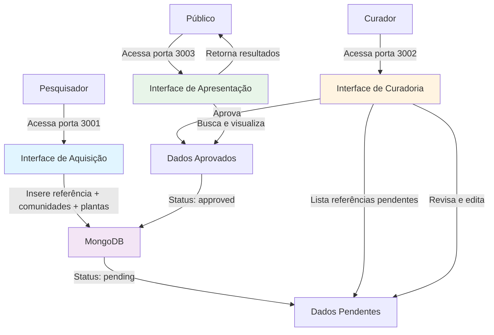

# etnoDB - Base de Dados Etnobotânica

<div align="center">
  
</div>

Sistema web para gerenciamento de **dados secundários** etnobotânicos sobre a relação entre comunidades tradicionais e plantas, extraídos de artigos científicos publicados.

## O que é Etnobotânica?

A etnobotânica é uma disciplina que investiga as interações e relações complexas entre as plantas e as pessoas ao longo do tempo e do espaço. Ela abrange o conhecimento tradicional e ocidental, incluindo os diversos usos (alimentares, medicinais, entre outros), a cosmovisão, os sistemas de gestão e classificação, e as línguas que as diferentes culturas mantêm em relação às plantas e aos seus ecossistemas terrestres e aquáticos associados. Em essência, busca compreender como as sociedades percebem, utilizam, manejam e atribuem significado cultural as plantas, atuando como uma ponte fundamental entre a biologia e as ciências humanas.

> Prance, G.T. Ethnobotany, the science of survival: a declaration from Kaua'i. *Econ Bot* **61**, 1–2 (2007). https://doi.org/10.1007/BF02862367

## Sobre o Projeto

O **etnoDB** é uma interface baseada na web para um banco de dados MongoDB que centraliza **dados secundários** sobre conhecimento tradicional de comunidades brasileiras em relação ao uso de plantas.

### O que são Dados Secundários?

**Dados secundários** são informações que já foram coletadas, publicadas e estão disponíveis em fontes existentes, como artigos científicos, livros, relatórios e outras publicações. Diferentemente dos dados primários (coletados diretamente pelo pesquisador através de entrevistas, observações ou experimentos), os dados secundários representam a compilação e sistematização de conhecimentos já documentados na literatura científica.

No contexto do etnoDB:
- **Fonte**: Artigos científicos publicados em periódicos revisados por pares
- **Conteúdo**: Relações documentadas entre comunidades tradicionais e plantas (usos, nomes vernaculares, conhecimentos associados)
- **Evidência**: Cada registro no banco de dados está vinculado à sua publicação científica original (referência bibliográfica completa com autores, ano, título, DOI)

Essa abordagem permite:
- Reunir conhecimento disperso em múltiplas publicações
- Facilitar buscas e análises integradas de dados etnobotânicos
- Preservar a rastreabilidade das informações até suas fontes originais
- Respeitar os direitos autorais e a ética na pesquisa com comunidades tradicionais

## Arquitetura

O projeto segue a arquitetura proposta em [etnoArquitetura](https://github.com/edalcin/etnoArquitetura), organizada em três contextos principais:

### 1. **Aquisição** (Entrada de Dados Secundários)
Interface dedicada à entrada de **dados secundários extraídos de artigos científicos publicados**.

**Porta**: 3001
**Funcionalidade**: Formulário hierárquico para entrada de:
- Referência bibliográfica completa (título, autores, ano, resumo, DOI)
- Comunidades tradicionais documentadas no artigo
  - O sistema suporta a classificação de comunidades tradicionais em 29 categorias, conforme o **[Decreto Nº 8.750, de 9 de maio 2016](https://www.planalto.gov.br/ccivil_03/_Ato2015-2018/2016/Decreto/D8750.htm)**, que regulamenta a Política Nacional de Desenvolvimento Sustentável dos Povos e Comunidades Tradicionais.

- Plantas e seus usos reportados para cada comunidade

**Importante**: Cada registro está sempre vinculado à sua publicação científica original, garantindo rastreabilidade e respeito aos direitos autorais.

### 2. **Curadoria** (Edição e Validação)
Interface especializada para controle de qualidade com acesso restrito a pesquisadores e representantes das comunidades.

**Porta**: 3002
**Funcionalidade**:
- Listagem de referências com status (pendente/aprovada/rejeitada)
- Edição de conteúdo (metadados, comunidades, plantas)
- Workflow de aprovação implementando princípios C.A.R.E. (Collective Benefit, Authority to Control, Responsibility, Ethics)
- **Justificativa de rejeição**: Campo obrigatório para documentar o motivo ao rejeitar uma referência, com exibição permanente do motivo e remoção automática ao alterar para outro status
- Validação taxonômica (planejada para implementação futura)

### 3. **Apresentação** (Busca e Visualização) - Home Page
Interface pública e padrão para disseminação dos dados curados, com apresentação aprimorada.

**Porta**: 3003 (Interface padrão)
**Funcionalidade**:
- Logo do projeto centralizado na home page
- Busca Google-like em todos os campos do documento
- Busca avançada por tipo de comunidade, nome da comunidade, planta (nome científico ou vernacular), estado e município
- Visualização de resultados em formato de cards responsivos
- Acesso aberto aos dados aprovados
- Exportação de dados em formatos abertos (planejado)

### 4. **Painel de Estatísticas** (Dashboard Analítico)
Interface visual interativa para exploração e análise dos dados etnobotânicos.

**Porta**: 3003 (Rota `/painel`)
**Funcionalidades**:
- **Cartões de Resumo**: Total de comunidades, referências aprovadas, plantas únicas e autores únicos
- **Mapas de Calor**: Distribuição geográfica de referências e comunidades por estado (GeoChart)
- **Gráficos Interativos**:
  - Evolução temporal de publicações por ano (gráfico de área)
  - Top 10 plantas mais citadas (gráfico de barras)
- **Tabelas Analíticas**:
  - Top 10 autores mais produtivos
  - Comunidades com maior número de plantas documentadas
  - Referências com mais comunidades estudadas
  - Referências com maior diversidade de plantas
- **Filtros Avançados**: Estado, tipo de comunidade e período de publicação
- **Tecnologia**: Google Charts + HTMX + Alpine.js

### 5. **etnoChat** (Interface Conversacional) - Em Desenvolvimento
Interface de conversação com IA para interagir com o banco de dados em linguagem natural.

**Porta**: 3003 (Rota `/etnochat`)
**Status**: Em desenvolvimento
**Funcionalidades Planejadas**:
- Perguntas em linguagem natural sobre comunidades e plantas
- Sugestões de buscas e relacionamentos entre dados
- Explicações contextualizadas sobre os dados etnobotânicos

## Estrutura de Dados

O banco de dados utiliza uma estrutura hierárquica em MongoDB, conforme definido em [`/docs/dataStructure.json`](./docs/dataStructure.json):

```
Referência (Publicação Científica)
├── titulo
├── autores[]
├── ano
├── resumo
├── DOI
├── status (pending/approved/rejected)
└── comunidades[] (uma ou mais)
    ├── nome
    ├── tipo (Andirobeiras, Caiçaras, Quilombolas, etc.)
    ├── municipio
    ├── estado
    ├── local
    ├── atividadesEconomicas[]
    ├── observacoes
    └── plantas[] (uma ou mais)
        ├── nomeCientifico[]
        ├── nomeVernacular[]
        └── tipoUso[]
```


```json
{
  "titulo": "string",
  "autores": ["SOBRENOME, I.", ...],
  "ano": number,
  "resumo": "string em português",
  "DOI": "string | null",
  "comunidades": [
    {
      "nome": "string",
      "tipo": "string (da lista válida)",
      "municipio": "string | null",
      "estado": "string | null",
      "local": "string | null",
      "atividadesEconomicas": ["string", ...] | null,
      "observacoes": "string | null",
      "plantas": [
        {
          "nomeCientifico": ["Genus species", ...],
          "nomeVernacular": ["nome-comum", ...],
          "tipoUso": ["string", ...]
        }
      ]
    }
  ]
}
```

## Stack Tecnológica

- **Backend**: Node.js 20 LTS + Express.js
- **Frontend**: HTMX + Alpine.js + Tailwind CSS
- **Banco de Dados**: MongoDB 7.0+
- **Containerização**: Docker (Alpine Linux)
- **Template Engine**: EJS
- **Testes**: Jest + mongodb-memory-server

## Arquitetura Técnica

- **Tipo de Projeto**: Aplicação web com backend e frontend
- **Organização**: Três aplicações Express rodando em portas separadas dentro de um único container Docker
- **Renderização**: Server-side rendering com HTMX para interatividade
- **Responsividade**: Design responsivo de 320px (mobile) a 1920px+ (desktop)

## Princípios C.A.R.E.

O projeto implementa os princípios C.A.R.E. para dados de povos indígenas e comunidades tradicionais:

- **C**ollective Benefit: Benefício coletivo para as comunidades
- **A**uthority to Control: Autoridade das comunidades sobre seus dados
- **R**esponsibility: Responsabilidade no uso dos dados
- **E**thics: Ética na coleta, armazenamento e disseminação

## Documentação Técnica

A documentação técnica completa está disponível em:

- **Instalação e Desenvolvimento**: [`INSTALLATION.md`](./INSTALLATION.md)
- **Especificação de Requisitos**: [`specs/spec.md`](./specs/spec.md)
- **Plano de Implementação**: [`specs/plan.md`](./specs/plan.md)
- **Modelo de Dados**: [`specs/data-model.md`](./specs/data-model.md)
- **Contratos de API**: [`specs/contracts/`](./specs/contracts/)
- **Quickstart para Desenvolvedores**: [`specs/quickstart.md`](./specs/quickstart.md)

## Workflow Completo



**Passos do workflow:**

1. **Pesquisador** acessa interface de **Aquisição** (porta 3001)
2. Insere dados da referência científica com comunidades e plantas
3. Dados salvos com status `pending`
4. **Curador** acessa interface de **Curadoria** (porta 3002)
5. Revisa e edita dados se necessário
6. Aprova ou rejeita referência (com justificativa obrigatória para rejeições)
7. **Público** acessa interface de **Apresentação** (porta 3003)
8. Busca e visualiza dados aprovados
9. Acessa **Painel de Estatísticas** (`/painel`) para análises visuais e exploratórias

## Segurança

- Sem autenticação por padrão (controle de acesso gerenciado em nível de rede/infraestrutura)
- Validação server-side de todos os dados
- Sanitização de inputs para prevenir XSS e NoSQL injection
- Todas as interfaces em português

## Próximas Funcionalidades

- Validação taxonômica automática (APIs de Flora e Funga do Brasil, GBIF)
- Autenticação para curadoria e entrada de dados
- Histórico de alterações (audit trail)
- Exportação de dados (CSV, JSON)
- API REST para integrações externas
- Integração com APIs de periódicos científicos
- Conclusão do etnoChat com integração via MCP (Model Context Protocol)

## Projetos Relacionados

O etnoDB faz parte de um ecossistema integrado de ferramentas para gestão de dados etnobotânicos:

### [etnoArquitetura](https://github.com/edalcin/etnoArquitetura)
Projeto principal que define a arquitetura de referência para sistemas etnobotânicos. Estabelece os três contextos fundamentais (Aquisição, Curadoria, Apresentação) e os padrões de design implementados no etnoDB.

### [etnopapers](https://github.com/edalcin/etnopapers)
Sistema de aquisição automatizada de dados secundários com auxílio de Inteligência Artificial. Permite a extração e inclusão de novos registros na base de dados do etnoDB a partir de artigos científicos de forma assistida por IA, agilizando o processo de entrada de dados.

## Contribuições

Contribuições são bem-vindas! Caso tenha sugestões, encontre bugs ou tenha comentários sobre o projeto, abra uma [Issue](../../issues).

## Suporte

Para questões, problemas ou sugestões sobre o etnoDB, utilize a seção [Issues](../../issues) do repositório.

## Contato

Para mais informações sobre o projeto:
- **Desenvolvedor**: Eduardo Dalcin - edalcin@jbrj.gov.br
- **Referência Arquitetônica**: [etnoArquitetura](https://github.com/edalcin/etnoArquitetura)

---

**Nota**: Este projeto documenta conhecimentos de comunidades tradicionais. O uso dos dados deve respeitar os direitos das comunidades e seguir os princípios C.A.R.E.
