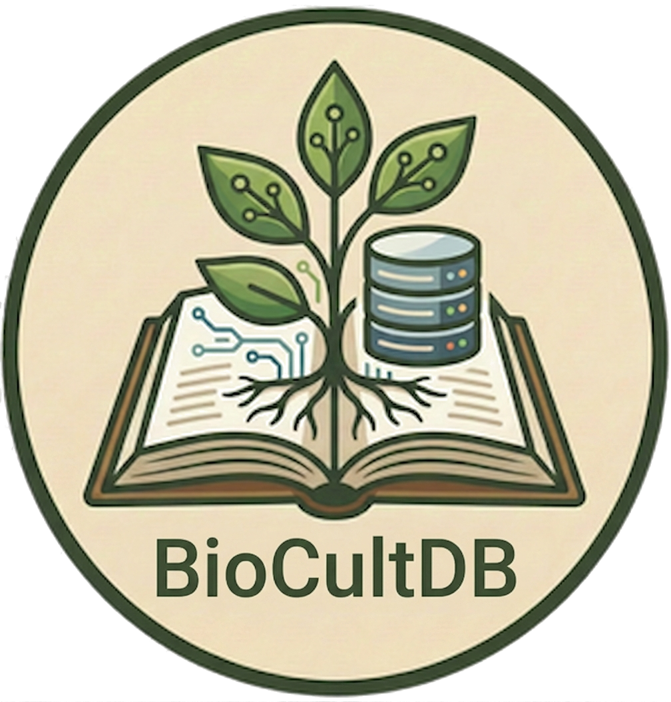
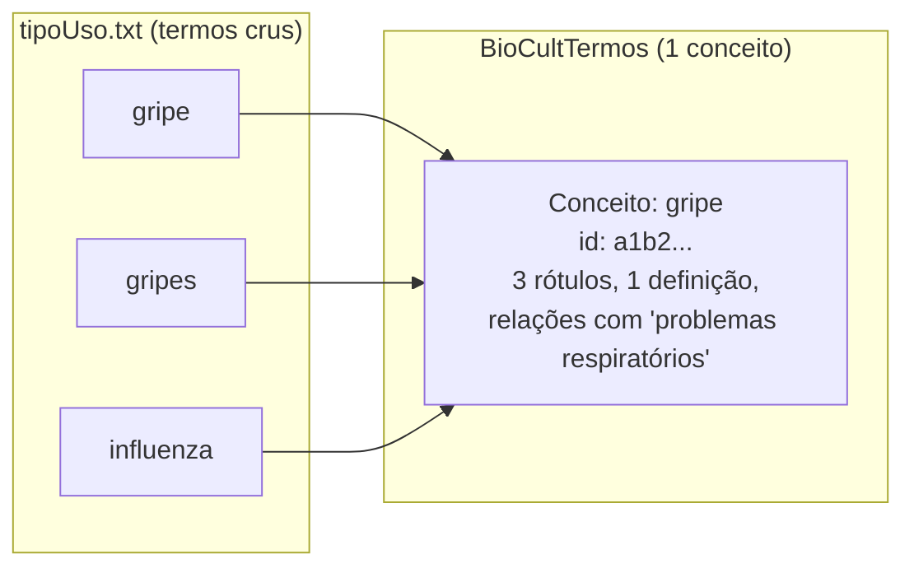
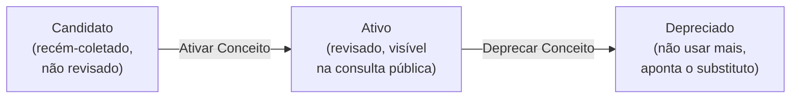
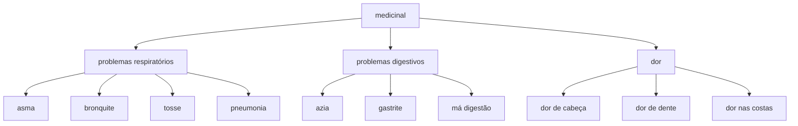
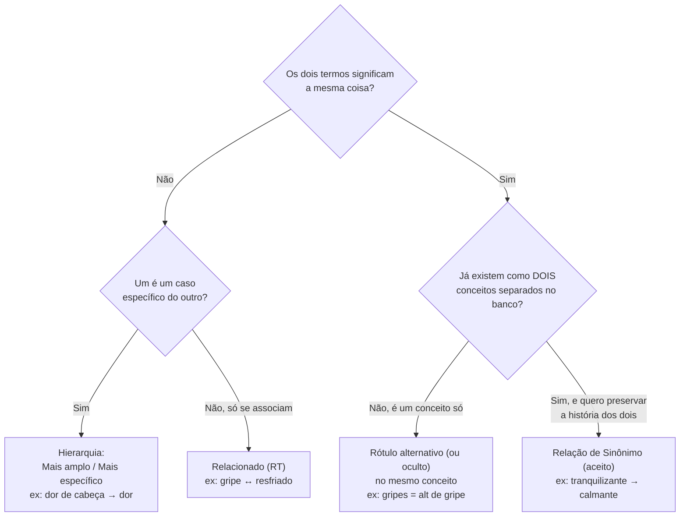
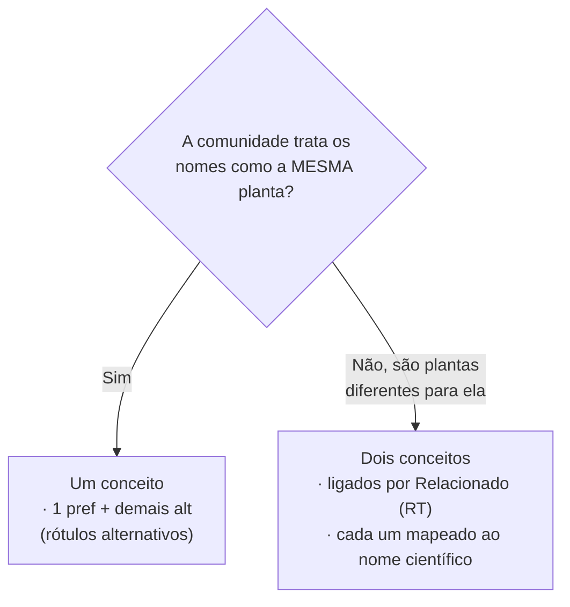
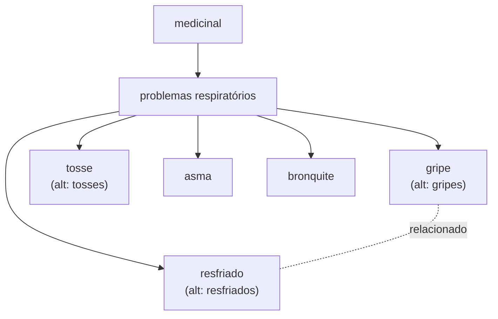

  

# Manual de Curadoria — Organizando Termos e Conceitos no BioCultTermos

### Um guia didático de SKOS-XL para o Conhecimento Tradicional Associado à Biodiversidade

> Este manual é para **curadores** do BioCultTermos. Não pressupõe conhecimento prévio de
> ontologias ou Web Semântica. A ideia é que, ao final, você saiba **por que** o sistema é
> organizado do jeito que é e **como** tomar as decisões certas na tela de edição de conceitos.
>
> Todos os exemplos usam termos reais de uso etnobotânico do arquivo
> [`tipoUso.txt`](tipoUso.txt) — a lista de "tipos de uso" que o BioCultDB coleta da
> literatura científica e entrega ao BioCultTermos para curadoria.

---

## Sumário

1. [O problema que estamos resolvendo](#1-o-problema-que-estamos-resolvendo)
2. [Termo × Conceito: a distinção fundamental](#2-termo--conceito-a-distinção-fundamental)
3. [Rótulos (SKOS-XL): nomes que carregam história](#3-rótulos-skos-xl-nomes-que-carregam-história)
4. [Definição e Notas: descrevendo o significado](#4-definição-e-notas-descrevendo-o-significado)
5. [O ciclo de vida de um conceito (status)](#5-o-ciclo-de-vida-de-um-conceito-status)
6. [Relações semânticas: conectando conceitos](#6-relações-semânticas-conectando-conceitos)
7. [Guia de decisão: qual mecanismo usar?](#7-guia-de-decisão-qual-mecanismo-usar)
8. [Passo a passo na tela de edição](#8-passo-a-passo-na-tela-de-edição)
9. [Exemplo completo, do início ao fim](#9-exemplo-completo-do-início-ao-fim)
10. [Erros comuns e boas práticas](#10-erros-comuns-e-boas-práticas)
11. [Glossário rápido](#11-glossário-rápido)

---

## 1. O problema que estamos resolvendo

O conhecimento tradicional associado à biodiversidade é **plural**. A mesma planta pode ser
chamada de dez jeitos diferentes por dez povos diferentes; o mesmo uso medicinal aparece na
literatura escrito de formas inconsistentes ("diarréia", "diarreia"), no singular e no plural
("gripe", "gripes"), de modo genérico e específico ("dor", "dor de cabeça").

Se guardarmos cada grafia como se fosse uma coisa isolada, perdemos a capacidade de responder
perguntas simples como *"quais plantas tratam problemas respiratórios?"* — porque "asma",
"bronquite", "tosse" e "gripe" ficariam soltas, sem nada dizendo que todas são problemas
respiratórios.

O BioCultTermos resolve isso organizando os termos segundo o padrão internacional
**SKOS-XL** (*Simple Knowledge Organization System — eXtension for Labels*). Antes de mexer na
tela, você precisa entender três palavras: **termo**, **conceito** e **rótulo**.

---

## 2. Termo × Conceito: a distinção fundamental

Esta é **a** ideia central do manual. Se você entender só isto, já usa o sistema muito melhor.

- **Termo** é uma *palavra ou expressão* — um pedaço de texto. O arquivo `tipoUso.txt` é uma
  lista de **termos crus**: `alimentício`, `dor de cabeça`, `febre`, `gripe`, `ritual`,
  `artesanato`... São só strings, sem significado organizado ainda.

- **Conceito** é uma *ideia* — uma unidade de significado, com identidade própria (um
  identificador único no banco). Um conceito pode ter **vários** termos como nome, uma
  definição, notas, e relações com outros conceitos.

> **Analogia:** pense num verbete de dicionário. A *palavra* impressa no topo é o termo; o
> *verbete inteiro* (com definição, sinônimos, exemplos, remissões a outros verbetes) é o
> conceito. Vários termos diferentes podem levar ao mesmo verbete.

Quando o BioCultDB coleta um artigo científico e encontra o uso `gripes`, ele não sabe ainda
se isso é um conceito novo ou apenas o plural de `gripe`. Então ele cria um **conceito
candidato** e deixa a decisão para você, curador. Seu trabalho é transformar a lista bruta de
termos numa **rede organizada de conceitos**.

**Regra de ouro:** três termos que significam a mesma coisa devem virar **um conceito com três
rótulos**, e não três conceitos separados.

---

## 3. Rótulos (SKOS-XL): nomes que carregam história

No BioCultTermos, cada nome de um conceito é um **rótulo** — e um rótulo não é só texto: é um
objeto com metadados próprios. É isso que o "XL" (*eXtension for Labels*) acrescenta ao SKOS
comum, e é exatamente o que o conhecimento tradicional exige.

Por quê? Porque *quem* deu o nome, *em que língua*, e *se ele pode ser divulgado* são
informações tão importantes quanto o nome em si.

### 3.1 Os três tipos de rótulo

Na tela de edição, seção **"Rótulos (SKOS-XL)"**, ao adicionar um rótulo você escolhe o **Tipo**:

| Tipo | Quando usar | Exemplo (`tipoUso.txt`) |
|---|---|---|
| **Preferencial** (`pref`) | O nome principal do conceito, num idioma. **Só pode haver um por idioma.** É o que aparece em destaque. | `febre` |
| **Alternativo** (`alt`) | Outro nome válido e visível para o **mesmo** conceito: plural, variação regional, sinônimo popular, tradução. | `febres` (plural de `febre`) |
| **Oculto** (`hidden`) | Grafia errada ou forma obsoleta que **não** deve aparecer ao público, mas ajuda a busca a encontrar o conceito. | `febri` (erro de digitação) |

Exemplos reais de clusters que devem virar **um conceito com vários rótulos**:

- Conceito **`gripe`** → pref: `gripe`; alt: `gripes` (plural); alt: `influenza`.
- Conceito **`gases`** → pref: `gases`; oculto: `gazes` (a forma da linha 233 do `tipoUso.txt`
  é uma grafia incorreta — vira rótulo **oculto**, não um conceito à parte).
- Conceito **`diabetes`** → pref: `diabetes`; alt: `diabete`.
- Conceito **`diarreia`** → pref: `diarreia`; oculto: `diarréia` (grafia pré-Acordo Ortográfico,
  mantida só para a busca encontrar textos antigos).

### 3.2 Idioma

Todo rótulo tem um **idioma** (código ISO 639-3 — na tela, o campo *"Idioma (ISO 639-3)"*, com
exemplos `por`, `eng`, `tup…`). Isto é o que permite um mesmo conceito ter o nome preferido em
português **e** o nome preferido numa língua indígena, cada um com seu próprio estatuto. A regra
"um preferencial por idioma" significa que você pode ter, no mesmo conceito, `pref/por` **e**
`pref/tup` ao mesmo tempo — um preferido para cada língua.

### 3.3 Nível de Acesso (accessLevel) — os Princípios CARE

Cada rótulo tem um **Nível de Acesso** próprio. É aqui que o sistema materializa o princípio
**Authority to Control** dos [Princípios CARE](https://www.gida-global.org/care): a comunidade
decide o que do seu conhecimento pode ser divulgado, e em que nível.

| Nível | Significado | Uso típico no contexto tradicional |
|---|---|---|
| **Público** (`public`) | Aberto para consulta na internet (porta pública). | A maioria dos usos medicinais e materiais gerais: `febre`, `artesanato`, `madeira`. |
| **Restrito** (`restricted`) | Visível apenas a pesquisadores autorizados. | Conhecimento sensível, sob acordo (SisGen/comunidade). |
| **Sagrado** (`sacred`) | Visível apenas à comunidade detentora. | Usos rituais e cerimoniais de acesso reservado. |

Repare em termos como `ritual` (400), `litúrgico` (286), `místico` (309), `descarrego` (119),
`defumação` (111) e `olho gordo` (318). Um uso genérico como "ritual" pode ser público, mas o
**nome específico** de uma prática cerimonial numa língua indígena pode ser `sacred` — e o
sistema permite marcar isso **rótulo por rótulo**, não o conceito inteiro. Um conceito pode ter o
rótulo em português como `public` e o rótulo cerimonial na língua originária como `sacred`.

> **Na prática:** ao cadastrar o nome de um uso ritual numa língua indígena, pergunte-se sempre:
> *"a comunidade autorizou divulgar este nome na internet?"*. Se não tiver certeza, use
> `restricted` ou `sacred`. O padrão do sistema é `public` — mude conscientemente.

### 3.4 Proveniência: de quem vem o nome

Ainda no formulário de rótulo, você tem:

- **Povo fonte** (`sourcePeople`) — de qual povo/comunidade vem este nome. Ex: *Guarani*.
- **Povo detentor (CARE)** (`holderPeople`) — o povo que detém o conhecimento (pode ser
  diferente de quem forneceu o dado ao pesquisador).
- **Consentimento prévio e informado registrado** (`priorInformedConsent`) — marque quando
  houver consentimento documentado (Protocolo de Nagoya).

Estes campos são o que diferencia um vocabulário **descolonizador** de uma simples lista de
palavras: o nome tradicional deixa de ser um apêndice anônimo e passa a carregar sua origem e
sua governança.

### 3.5 Quando não há nome preferido: rótulos co-iguais

Muitas vezes **não existe** um nome preferido: uma comunidade chama a mesma planta por dois ou três
nomes igualmente válidos, e a academia e o público em geral também usam vernaculares sem preferência
fixa. Além disso, os nomes que chegam da coleta entram todos como `pref` em português — o que é só
**ordem de coleta**, não preferência real.

Entenda o ponto central: **o tipo `preferencial` é um âncora de exibição, não um juízo de valor.**
Ele diz apenas *"é este o nome que a tela mostra em destaque e pelo qual a busca ordena"* — nunca
*"este nome vale mais que os outros"*. A regra "um preferencial por idioma" (§3.1) é **técnica**: a
interface precisa de **uma** string estável por idioma.

Então, quando não há preferência:

1. Cadastre **todos** os nomes co-iguais do mesmo idioma como **alternativos**.
2. Eleja **um** como preferencial, com "★ Tornar Preferencial", apenas como âncora de exibição.
   Escolha por um critério neutro, nesta ordem:
   - a convenção da própria comunidade, se ela tiver uma (Princípio CARE *Authority to Control*);
   - senão, o nome mais frequente nas fontes;
   - senão, ordem alfabética.
3. Escreva na **Nota de Escopo** que a escolha do preferencial é **arbitrária, só para exibição**, e
   que os alternativos são **igualmente válidos**. Assim o próximo curador não lê hierarquia onde
   não há.

> **Idiomas diferentes não competem.** Um `pref/por` e um `pref` numa língua indígena coexistem
> (§3.2). O desempate acima só se aplica a nomes **do mesmo idioma**.

> **Não deixe o conceito sem preferencial** para "representar" a ausência de preferência: isso faz
> o nome aparecer como *(sem rótulo)* em listas, títulos e busca. A ausência de preferência se
> registra **na Nota de Escopo** — não deixando o campo vazio.

---

## 4. Definição e Notas: descrevendo o significado

A seção **"Definição e Notas"** descreve o **conceito como um todo** (não um rótulo específico).
São quatro campos de texto livre, em português:

| Campo | O que responde | Exemplo para o conceito `medicinal` |
|---|---|---|
| **Definição** | O que o conceito **é**, de forma objetiva. | "Uso de uma planta com finalidade de tratar, aliviar ou prevenir enfermidades." |
| **Nota de Escopo** | **Quando usar** este termo em vez de outro parecido. | "Categoria ampla; para um sintoma específico, use o uso correspondente (`febre`, `dor de cabeça`). Uso ritual sem finalidade curativa vai em `ritual`." |
| **Nota Histórica** | Origem do termo, mudanças de uso, se substituiu outro. | "Termo guarda-chuva consolidado a partir de dezenas de usos específicos coletados entre 2015 e 2024." |
| **Exemplo de Uso** | Um trecho real mostrando o termo em contexto. | "'As folhas são usadas para fins medicinais, em chá, contra a febre.'" |

A **Nota de Escopo** é a sua ferramenta mais poderosa contra a ambiguidade. Muitos termos do
`tipoUso.txt` só fazem sentido com uma delimitação clara: qual a diferença de uso entre
`calmante` (38), `sedativo` (408) e `tranquilizante` (427)? Se você decidir, escreva na Nota de
Escopo de cada um — assim o próximo curador não vai reinventar a distinção.

---

## 5. O ciclo de vida de um conceito (status)

Todo conceito passa por três estados. Na tela de edição, a seção **"Ações de Status"** mostra
os botões conforme o estado atual.

- **Candidato** — todo termo que o BioCultDB coleta entra assim. Ainda **não aparece** na
  consulta pública. É a fila de trabalho do curador.
- **Ativo** — depois que você revisou rótulos, definição e relações, clique em **"Ativar
  Conceito"**. A partir daí ele é consultável publicamente (respeitando o `accessLevel` de cada
  rótulo).
- **Depreciado** — quando um conceito não deve mais ser usado (foi duplicado, corrigido ou
  substituído). É **obrigatório** informar o conceito substituto ("Substituído por").

> **Proteção contra conflito:** se duas pessoas editam o mesmo conceito ao mesmo tempo, quem
> salvar por último recebe um aviso de conflito (o sistema não sobrescreve o trabalho da outra
> pessoa silenciosamente). Basta recarregar e refazer sobre a versão atual.

---

## 6. Relações semânticas: conectando conceitos

Aqui está o coração da organização. A seção **"Relações Semânticas"** liga **um conceito a
outro conceito** (nunca a um rótulo). Existem quatro tipos de relação, cada um com um significado
preciso.

### 6.1 Mais amplo (BT) e Mais específico (NT) — hierarquia

A relação hierárquica diz que um conceito é um **caso particular** de outro. É a relação de
"tipo de / parte de".

- **Mais amplo (BT)** = *Broader Term* — aponta para o conceito mais geral (o "pai").
- **Mais específico (NT)** = *Narrower Term* — o inverso, o conceito mais particular (o "filho").

Elas são **recíprocas automáticas**: se você marca que `dor de cabeça` tem como *mais amplo*
`dor`, o sistema já registra que `dor` tem `dor de cabeça` como *mais específico*.

O `tipoUso.txt` está cheio de hierarquias esperando para ser montadas:

Todos esses termos existem na lista: `medicinal` (299), `problemas respiratórios` (374),
`asma` (19), `bronquite` (32), `tosse` (425), `pneumonia` (347), `problemas digestivos` (359),
`azia` (22), `gastrite` (232), `má digestão` (308), `dor` (138), `dor de cabeça` (140),
`dor de dente` (141), `dor nas costas` (152). Montar essa árvore é o que permite, no futuro,
responder *"quais plantas tratam problemas respiratórios?"* e receber também as que só constam
como tratando "asma" ou "tosse".

> **Cuidado com ciclos:** um conceito não pode ser, ao mesmo tempo, ancestral e descendente de
> outro. O sistema bloqueia isso automaticamente (você veria um aviso de "ciclo hierárquico").

### 6.2 Relacionado (RT) — associação entre iguais

**Relacionado (RT)** = *Related Term* liga dois conceitos **distintos e igualmente válidos**,
que se associam por contexto — sem que nenhum seja "tipo de" o outro nem mais correto que o
outro. É uma relação **simétrica** (vale nos dois sentidos).

Exemplos do `tipoUso.txt`:

- `gripe` (236) **relacionado a** `resfriado` (392) — quadros diferentes, frequentemente
  confundidos e tratados com as mesmas plantas; conectá-los ajuda a consulta. Mas **não** são a
  mesma coisa (não use sinônimo) nem um é tipo do outro (não use hierarquia).
- `verme` (443) **relacionado a** `vermicida` (445) — um é a doença/parasita, o outro é o efeito
  da planta; associados, mas conceitos distintos.

### 6.3 Sinônimo de (aceito) — equivalência com um termo preferido

Esta relação é a que exige mais atenção, porque é fácil confundir com **rótulo alternativo**
(veja a seção 7). Use **"Sinônimo de (aceito)"** quando dois conceitos **já existem
separadamente** no banco, significam a mesma coisa, e você quer marcar que **um é o termo
aceito** e o outro é apenas um sinônimo dele — **sem apagar nenhum dos dois** (para preservar o
histórico e a proveniência de cada um).

- A relação é **direcionada**: parte do sinônimo e aponta para o conceito aceito.
- O conceito aceito exibe seus sinônimos em **"Sinônimos deste conceito"** (somente leitura).

Exemplo: suponha que a coleta criou, de artigos diferentes, os conceitos separados
`tranquilizante` (427) e `calmante` (38). Você decide que `calmante` é o termo preferido. Então,
na edição de `tranquilizante`, adicione **"Sinônimo de (aceito)"** → `calmante`. Pronto:
`tranquilizante` fica marcado como sinônimo, e `calmante` passa a listá-lo entre seus sinônimos.

> **Por que esta relação existe, se o SKOS puro trataria sinônimos como rótulos?**
> Porque, quando dois conceitos **já foram curados separadamente** (cada um com sua definição,
> notas e proveniência vindas de fontes distintas), transformá-los num conceito só apagaria essa
> história. A relação de sinônimo os reconcilia **sem destruir** o registro de origem de cada um.
> Ainda assim, **o padrão recomendado é evitar chegar nessa situação** — veja a seção 7.

### 6.4 A regra que impede contradição

Dois conceitos ligados por **Sinônimo** **não podem** também ser ligados por **Relacionado (RT)**
— o sistema recusa. Faz sentido: "Relacionado" afirma *"somos dois conceitos igualmente
válidos"*; "Sinônimo" afirma o oposto, *"um de nós é o preferido, o outro não"*. As duas
relações sobre o mesmo par seriam contraditórias. Pela mesma lógica, um conceito não pode ser
sinônimo de si mesmo, nem dois conceitos podem ser sinônimos recíprocos um do outro (só um lado
pode ser o "aceito").

---

## 7. Guia de decisão: qual mecanismo usar?

Esta é a pergunta que mais gera dúvida: *"os termos X e Y são a mesma coisa — uso rótulo
alternativo ou relação de sinônimo? E se não forem a mesma coisa?"*

A diferença crucial é de **nível**:

- **Rótulo alternativo** = outro nome para a **MESMA linha** do banco (o mesmo conceito, o mesmo
  `id`). Não cria nada novo — só acrescenta um nome ao conceito que você está editando.
- **Relação de sinônimo** = **UMA linha apontando para outra** (dois conceitos, dois `id`s, cada
  um com sua própria definição e história).

Fluxo de decisão para dois termos parecidos:

**Preferência recomendada:** sempre que possível, prefira **um conceito com vários rótulos** em
vez de vários conceitos ligados por sinônimo. A relação de sinônimo é a **exceção** (para quando
juntar apagaria proveniência), não a regra. Um vocabulário com muitos conceitos "sinônimos" uns
dos outros, quando poderiam ser um só, é mais difícil de manter.

### 7.1 O caso clássico: trocar qual rótulo é o preferido

Situação real: o conceito foi criado com o preferencial `alimentação`, mas você decide que o
termo preferido deveria ser `alimentar` (ou o inverso). Você **não** troca o tipo do rótulo
diretamente (isso deixaria o conceito sem nenhum preferencial por um instante). O fluxo correto:

1. Adicione o novo nome como rótulo **Alternativo** (formulário "+ Adicionar Rótulo").
2. No card desse novo rótulo, clique em **"★ Tornar Preferencial"**.

O sistema promove o novo a preferencial e rebaixa o antigo a alternativo **na mesma operação**,
sem nunca passar por um estado inválido. Tudo continua sendo **um conceito só**.

### 7.2 Nomes vernaculares do mesmo conceito: alternativo, não relacionado

Dois ou mais nomes vernaculares para a **mesma planta** são, por padrão, **rótulos alternativos de
um único conceito** — nunca conceitos separados ligados por "Relacionado". É a regra de ouro (§2)
aplicada a nomes populares: mesmo significado → **um conceito, vários rótulos**.

- Ex.: `gervão`, `gervão-roxo` e `rinchão` usados pela comunidade para a mesma planta → **um**
  conceito, um `pref` (âncora de exibição, §3.5) e os demais como `alt`.
- **"Relacionado (RT)" estaria errado** aqui: RT liga dois conceitos **distintos** (como
  `gripe` ↔ `resfriado`, §6.2). Usá-lo para nomes da mesma planta fragmentaria a espécie em vários
  conceitos e apagaria o fato de que são o mesmo.

**A exceção (etnotaxonomia).** O teste não é "mesma espécie científica" — é *"**mesma unidade de
significado para quem usa o nome**"*. Às vezes a comunidade **distingue** dois nomes como plantas
diferentes (por morfotipo, sexo, estágio ou uso), embora o botânico os agrupe numa só espécie
(sobre-diferenciação — ver [avaliacaoCamposSemativos.md](avaliacaoCamposSemativos.md), Avaliação 1).
Nesse caso são **dois etnotáxons distintos**:

- ligue-os entre si por **Relacionado (RT)** (associados, mas distintos);
- e mapeie **cada um** ao mesmo nome científico.

> **Compartilhar a espécie científica não basta** para ser o mesmo conceito. Co-referência não é
> identidade conceitual: quem decide se é um ou dois conceitos é a distinção de significado na
> comunidade, não a determinação taxonômica.

---

## 8. Passo a passo na tela de edição

Juntando tudo, aqui está o percurso típico ao curar um conceito candidato. Cada seção da tela
tem um botão **?** de ajuda ao lado do título — este manual é a versão longa daquelas caixas.

**Passo 1 — Entenda o conceito.** Leia o rótulo que veio da coleta. Ele é um conceito de
verdade, ou é variação/parte de outro que já existe? Use a busca do sistema para verificar.

**Passo 2 — Ajuste os Rótulos (seção "Rótulos (SKOS-XL)").**
- Confirme o **preferencial** correto (um por idioma). Se precisar trocar, use "★ Tornar
  Preferencial" (seção 7.1).
- Adicione plurais, variações regionais e traduções como **alternativos**.
- Jogue grafias erradas em **ocultos** (ajudam a busca sem poluir a exibição).
- Para cada rótulo, defina **Nível de Acesso** e **proveniência** (Povo fonte / detentor /
  consentimento) — especialmente crítico para nomes em línguas indígenas e usos rituais.

**Passo 3 — Preencha Definição e Notas.** No mínimo a **Definição** e, se houver risco de
confusão com termos vizinhos, a **Nota de Escopo**.

**Passo 4 — Monte as Relações Semânticas.**
- Ligue ao conceito mais amplo (**Mais amplo / BT**) — ex.: `febre` → `medicinal`.
- Marque conceitos apenas associados como **Relacionado (RT)**.
- Se for um sinônimo de um conceito aceito já existente, use **Sinônimo de (aceito)**.

**Passo 5 — Ative.** Com tudo revisado, clique em **"Ativar Conceito"**. Ele passa a ser
consultável publicamente.

---

## 9. Exemplo completo, do início ao fim

Vamos curar o grupo respiratório de verdade. A coleta trouxe estes candidatos soltos do
`tipoUso.txt`: `gripe`, `gripes`, `gripe e tosse`, `tosse`, `tosses`, `resfriado`,
`resfriados`, `asma`, `bronquite`, `problemas respiratórios`.

**Decisões de curadoria:**

1. **`problemas respiratórios`** vira o conceito guarda-chuva.
   - Definição: "Uso medicinal no tratamento de afecções do sistema respiratório."
   - Mais amplo → `medicinal`.

2. **`gripe`** vira um conceito.
   - prefLabel: `gripe` (por, público).
   - altLabel: `gripes` (plural — **mesmo conceito**, não crie outro).
   - Mais amplo → `problemas respiratórios`.
   - Relacionado → `resfriado` (associados, mas distintos).

3. **`resfriado`** vira um conceito.
   - prefLabel: `resfriado`; altLabel: `resfriados` (plural).
   - Mais amplo → `problemas respiratórios`.

4. **`tosse`** vira um conceito.
   - prefLabel: `tosse`; altLabel: `tosses`.
   - Mais amplo → `problemas respiratórios`.

5. **`gripe e tosse`** — este é um termo **composto** que a coleta capturou como um só. Ele não é
   um conceito novo: é a co-ocorrência de dois conceitos que já temos. Opção recomendada:
   **deprecar** `gripe e tosse` e, na depreciação, apontar `gripe` como substituto (ou tratá-lo
   como rótulo oculto de `gripe`, para a busca ainda encontrá-lo). O importante é **não** deixá-lo
   como um conceito ativo paralelo — isso fragmentaria a informação.

6. **`asma`** e **`bronquite`** viram conceitos, ambos com Mais amplo → `problemas respiratórios`.

Resultado: em vez de dez termos soltos, temos uma pequena árvore navegável e sem duplicatas —
com plurais recolhidos como rótulos, um termo composto resolvido, e as associações certas.

---

## 10. Erros comuns e boas práticas

| ❌ Erro comum | ✅ Prática correta |
|---|---|
| Criar `gripe` e `gripes` como dois conceitos. | Um conceito `gripe` com `gripes` como rótulo **alternativo**. |
| Corrigir grafia apagando o termo errado. | Guarde a grafia errada como rótulo **oculto** — a busca ainda encontra textos que a usam. |
| Marcar `dor de cabeça` como **relacionado** a `dor`. | É hierarquia: `dor de cabeça` tem **Mais amplo** → `dor`. |
| Marcar `gripe` como **sinônimo** de `resfriado`. | São distintos: use **Relacionado (RT)**. |
| Usar sinônimo quando é a mesma linha do banco. | Se é o mesmo conceito, é **rótulo alternativo**, não relação de sinônimo. |
| Divulgar nome ritual em língua indígena como `public` por padrão. | Avalie o `accessLevel`; na dúvida sobre autorização, use `restricted` ou `sacred`. |
| Deixar o conceito como `candidate` "para depois". | Ative quando estiver revisado — candidatos não aparecem na consulta pública. |
| Trocar o tipo do único preferencial para "alternativo". | Adicione o novo rótulo e use **"★ Tornar Preferencial"** (troca atômica). |
| Deprecar sem indicar substituto. | A depreciação **exige** o conceito "Substituído por". |
| Ler o `pref` de um nome vernacular como "o nome certo". | `pref` é só âncora de exibição; nomes co-iguais são **alternativos** e a escolha do preferencial vai anotada como arbitrária na Nota de Escopo (§3.5). |
| Ligar dois nomes vernaculares da mesma planta por **Relacionado (RT)**. | Se nomeiam o mesmo conceito, são **rótulos alternativos** de um conceito (§7.2); RT só quando a comunidade os distingue como plantas diferentes. |

**Princípio geral:** na dúvida entre criar um conceito novo ou enriquecer um existente, prefira
**enriquecer** — menos conceitos, mais rótulos e relações. Um vocabulário bem curado é raso em
duplicatas e rico em conexões.

---

## 11. Glossário rápido

| Termo | Significado no BioCultTermos |
|---|---|
| **Termo** | Uma palavra/expressão crua (ex.: uma linha do `tipoUso.txt`). |
| **Conceito** | Uma unidade de significado com identidade própria, que reúne rótulos, notas e relações. |
| **Rótulo (SKOS-XL)** | Um nome do conceito, com metadados próprios (idioma, tipo, acesso, proveniência). |
| **Preferencial / Alternativo / Oculto** | Os três tipos de rótulo: nome principal / variação visível / forma escondida (para busca). |
| **accessLevel** | Nível de acesso de um rótulo: `public`, `restricted`, `sacred` (Princípios CARE). |
| **sourcePeople / holderPeople** | Povo de origem do nome / povo detentor do conhecimento. |
| **Definição / Nota de Escopo / Nota Histórica / Exemplo** | Campos de texto que descrevem o conceito. |
| **Mais amplo (BT) / Mais específico (NT)** | Relação hierárquica entre conceitos (pai/filho), recíproca automática. |
| **Relacionado (RT)** | Associação simétrica entre dois conceitos distintos e igualmente válidos. |
| **Sinônimo de (aceito) / Sinônimos deste conceito** | Relação direcionada entre dois conceitos separados, marcando qual é o preferido. |
| **Status: candidato / ativo / depreciado** | Ciclo de vida do conceito. |
| **CARE** | Princípios de governança de dados indígenas: *Collective benefit, Authority to control, Responsibility, Ethics*. |

---

> **Padrão de referência:** [W3C SKOS-XL](https://www.w3.org/TR/skos-reference/skos-xl.html) ·
> [Princípios CARE](https://www.gida-global.org/care) ·
> [Darwin Core (TDWG)](https://dwc.tdwg.org/) ·
> [Protocolo de Nagoya](https://www.cbd.int/abs/)
>
> Este manual documenta o comportamento atual da tela de edição do BioCultTermos. As caixas de
> ajuda (**?**) dentro do sistema trazem versões resumidas destes mesmos conceitos.
