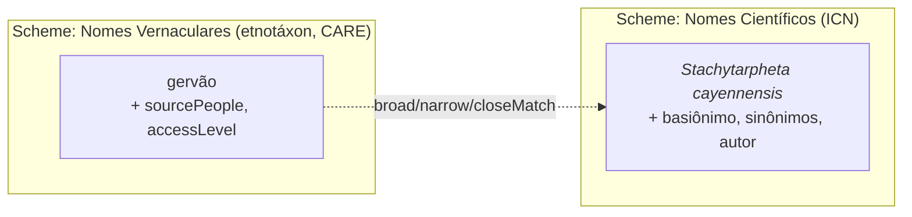

# Avaliação: unificar "Nomes Científicos de Plantas" e "Nomes Vernaculares de Plantas"?

> **Questão.** Considerando o [Manual de Curadoria](Manual.md) e o padrão SKOS-XL, seria
> razoável unificar os campos semânticos **"Nomes Científicos de Plantas"** e **"Nomes
> Vernaculares de Plantas"** num só conceito, visto que ambos seriam representações do mesmo
> conceito de "espécie"? Análise sob a ótica da **etnotaxonomia** e das **regras de nomenclatura
> científica**.

## Veredito

**Não.** Fundir os dois campos num só conceito (nome científico e nome vernacular como rótulos
`pref` do mesmo conceito) seria **incorreto**, apesar de intuitivo. O erro está na premissa:
nome científico e nome vernacular **co-referem** (apontam para plantas sobrepostas no mundo
real), mas **não são o mesmo conceito** no sentido do manual (§2: conceito = unidade de
significado / classificação, não a coisa apontada). Co-referência não é identidade conceitual.

## Por que a premissa "mesmo conceito de espécie" falha

### 1. Etnotaxonomia ≠ taxonomia científica — não há mapa 1:1

O táxon *folk* não corresponde à espécie lineana. Três desencontros clássicos (Berlin,
classificação etnobiológica):

- **Sub-diferenciação:** um nome vernacular cobre várias espécies científicas
  (ex.: "gervão" → várias *Stachytarpheta*).
- **Sobre-diferenciação:** várias etnoespécies (por morfotipo, sexo, estágio de vida ou uso)
  para uma única espécie científica.
- **Homonímia regional:** o mesmo nome vernacular para espécies não aparentadas em regiões/povos
  diferentes; e o mesmo científico com dezenas de vernaculares por comunidade/língua.

O vernacular denota um **etnotáxon** — unidade cultural que pode ser mais ampla, mais estreita ou
transversal à espécie. Não é "outro nome da espécie": é outra unidade de classificação.

### 2. As regras de nomenclatura dão estrutura interna ao nome científico

Sob o **ICN** (*International Code of Nomenclature for algae, fungi, and plants*), uma espécie tem
nome aceito + basiônimo + sinônimos homotípicos/heterotípicos + autor + ano, revisável por revisão
taxonômica. Isso é uma **rede de sinonímia própria** — exatamente o que o manual modela com
"Sinônimo de (aceito)" (§6.3) e depreciação com substituto (§5). Rebaixar o nome científico a um
simples rótulo de um conceito fundido **destrói essa estrutura**.

### 3. Governança e proveniência incompatíveis

| Aspecto | Nome científico | Nome vernacular |
|---|---|---|
| Autoridade | ICN (código nomenclatural) | Comunidade detentora (Princípios CARE) |
| Verificação | Objetiva (WFO / IPNI / Tropicos) | Etnográfica, contextual |
| Idioma | Latim (`lat`) | `por`, línguas indígenas (`tup…`) |
| Proveniência | Autor + ano | `sourcePeople` / `holderPeople` |
| Acesso | Público | Pode ser `restricted` / `sacred` (Nagoya) |

São **dois regimes de autoridade distintos**. Um binômio latino público e um nome ritual indígena
`sacred` como co-rótulos do mesmo conceito conflacionam essas duas governanças.

## O que o próprio manual diz

O guia de decisão (§7) começa em *"os dois termos significam a mesma coisa?"*. Para científico ×
vernacular a resposta honesta é **"não exatamente / nem sempre"** — cai no ramo de **conceitos
distintos**, não no ramo "um conceito, vários rótulos".

O contra-argumento fácil — *"§3.2 permite um `pref` por idioma, logo poderia `pref/lat` +
`pref/por`"* — **não salva a fusão**: os rótulos multilíngues do §3.2 são **tradução do mesmo
conceito** (`gripe` / `influenza` / nome indígena da *mesma* doença). Científico ↔ vernacular
**não é tradução** — é **mapeamento entre dois sistemas de classificação** de granularidade e
governança diferentes.

## O modelo correto

Manter **dois campos / dois *schemes*** e ligá-los por **relação de mapeamento**, não por rótulo:

- **Nome científico** = conceito no seu *scheme* (regido pelo ICN, com sua rede de sinonímia).
- **Nome vernacular** = conceito etnotáxon (com CARE e proveniência por povo).
- **Ligação por *match* SKOS** conforme o ajuste de granularidade:
  - `skos:closeMatch` / `skos:exactMatch` quando há correspondência 1:1;
  - **`skos:broadMatch` / `skos:narrowMatch` quando há sub/sobre-diferenciação** — justamente o
    que captura o desencontro etnotaxonômico.
  - Na paleta atual da tela, o análogo disponível é **"Relacionado (RT)"** entre *schemes*.

Isso alinha com o **Darwin Core** (referência do próprio manual): DwC trata `scientificName` como
identidade do táxon e `vernacularName` como atributo **associado** (extensão *VernacularName*,
muitos-para-um) — **associação, não identidade**.

## Resumo

Co-referência **não** é identidade conceitual. Fundir os campos apagaria a sinonímia
nomenclatural do lado científico, achataria a plasticidade do etnotáxon do lado vernacular e
misturaria as governanças ICN vs CARE. O correto é **dois conceitos ligados por mapeamento**
(`broadMatch` / `narrowMatch` / `closeMatch`), preservando tanto o rigor nomenclatural quanto a
pluralidade e a soberania dos nomes tradicionais.

---

> **Padrões de referência:** [W3C SKOS-XL](https://www.w3.org/TR/skos-reference/skos-xl.html) ·
> [ICN](https://www.iapt-taxon.org/nomen/main.php) ·
> [Darwin Core (TDWG)](https://dwc.tdwg.org/) ·
> [Princípios CARE](https://www.gida-global.org/care) ·
> [Protocolo de Nagoya](https://www.cbd.int/abs/)

---

# Avaliação 2 — Nomes vernaculares e o rótulo "preferencial" quando não há preferência

> **Questão.** Como tratar o *tag* `pref` (preferencial) em nomes vernaculares? Muitas vezes uma
> comunidade tradicional tem dois ou mais nomes para a mesma planta **sem nenhum preferido**; a
> academia e a população em geral também usam vernaculares sem preferência definida; e o BioCultDB
> entrega nomes vernaculares (associados ou não a nomes científicos) **sem sinalização de qual
> seria o preferencial**.

## Veredito

O `pref` do SKOS/SKOS-XL é um **âncora de exibição e indexação**, não um juízo de valor cultural.
"Preferencial" quer dizer *"o nome que a interface mostra em destaque e pelo qual o índice ordena
e busca"* — **não** *"o nome que a comunidade considera superior"*. Quando não há preferência
real, todos os nomes são **co-iguais** (entram como `alt`), e **um** é elevado a `pref` apenas
como âncora de exibição, por um critério neutro e documentado.

## Por que `pref` não é hierarquia cultural

- No SKOS-XL, `pref`/`alt` qualificam o **vínculo** entre conceito e rótulo, não uma qualidade
  intrínseca do nome. O mesmo literal pode ser `pref` de um conceito e `alt` de outro. Logo,
  `pref` **não** afirma "melhor nome".
- Definição W3C: `skos:prefLabel` = *"the preferred lexical label ... in a given language"*;
  `skos:altLabel` = *"an alternative lexical label"*, isto é, um **nome igualmente aceitável**. A
  distinção existe para dar às ferramentas **uma string estável de exibição por idioma** (título,
  listas, *breadcrumbs*), ordenação determinística e uma entrada única no índice de busca.
- Restrição **técnica** (não cultural): o BioCultTermos impõe **no máximo um `pref` por idioma**
  (`lib/skosxl/validation.js` → `validateSinglePrefLabelPerLanguage`) — materialização da condição
  de integridade S14 do SKOS-XL. Não há regra "um dos nomes é o certo"; há regra "só um âncora por
  idioma".

## A realidade da aquisição no BioCultDB

O `AcquisitionService` grava **cada valor coletado como `pref/pt`** (`services/AcquisitionService.js`).
Ou seja: o `pref` que chega da coleta é **artefato da ordem de coleta**, não sinal de preferência.
Cabe ao curador rebaixar os demais a `alt`, escolher o âncora de exibição, e **não** ler o `pref`
herdado como significativo.

## Como tratar (regra prática)

1. Todos os nomes co-iguais do **mesmo idioma** entram como `alt`; **um** vira `pref` (âncora de
   exibição), via "★ Tornar Preferencial" (troca atômica).
2. **Critério de desempate** para escolher o âncora, em ordem (neutro, documentado):
   1. convenção da própria comunidade, se houver (CARE — *Authority to Control*);
   2. senão, o mais frequente no corpus do BioCultDB;
   3. senão, ordem alfabética (puramente mecânico).
3. Registre na **Nota de Escopo** que a escolha do `pref` é **arbitrária / para exibição** e que os
   `alt` são **co-iguais**. A hierarquia vive só na interface — e a nota diz isso.
4. Nomes em **idiomas diferentes** não competem: um `pref/por` e um `pref` numa língua indígena
   coexistem (§3.2 do Manual). O desempate só surge **dentro do mesmo idioma**.
5. A presença/ausência de nome científico associado **não** muda o tratamento dos rótulos: o
   conceito vernacular se sustenta sozinho, com seus `alt` co-iguais, ligado (ou não) ao científico
   por mapeamento (ver Avaliação 1).

## Por que não deixar "sem `pref`" para representar "sem preferência"

O modelo aceita conceito sem `pref` (cai para *(sem rótulo)* / *slug* pelo `id`). Mas isso
**degrada a exibição em toda parte** — título, listas, *pills* de relação e busca passam a mostrar
*(sem rótulo)* — sem ganho semântico: o fato "são co-iguais" é melhor carregado **explicitamente na
Nota de Escopo** do que por um `pref` vazio. Logo: **sempre** defina um `pref` de exibição; a
co-igualdade fica na nota.

---

# Avaliação 3 — Nomes vernaculares do mesmo conceito: "alternativo" ou "relacionado"?

> **Questão.** Nomes vernaculares usados para o mesmo conceito de espécie devem ser tratados como
> **termo alternativo** (rótulo `alt`) ou como **termo relacionado** (relação RT)?

## Veredito

**Termo alternativo (rótulo `alt`), não relacionado** — por padrão. Vários nomes vernaculares para
a **mesma planta** são **um único conceito com vários rótulos**, seguindo a regra de ouro (§2 do
Manual) e o guia de decisão (§7): *mesmo significado → um conceito, muitos rótulos*. "Relacionado
(RT)" liga conceitos **distintos**; usá-lo aqui fragmentaria a espécie em vários conceitos.

## Por quê

- **`alt` = mesmo conceito, outro nome.** É exatamente o caso: `gervão`, `gervão-roxo`, `rinchão`
  (mesma planta) → um conceito, um `pref` (âncora de exibição, §3.5) + demais `alt`.
- **RT = dois conceitos distintos que se associam** (`gripe` ↔ `resfriado`, §6.2). Aplicá-lo a
  nomes da mesma planta afirma, erradamente, "são coisas diferentes" e espalha a informação por
  conceitos duplicados.
- **Sinônimo (aceito) também não.** Essa relação é a exceção para dois conceitos **já curados
  separadamente** cuja fusão apagaria proveniência (§6.3). Para nomes vernaculares que chegam
  juntos, o caminho é enriquecer um conceito só, não criar dois.

## A exceção (etnotaxonomia)

O teste **não** é "mesma espécie científica" — é *"**mesma unidade de significado para quem usa o
nome**"*. Quando a comunidade **distingue** dois nomes como plantas diferentes (sobre-diferenciação:
morfotipo, sexo, estágio, uso), embora o botânico os una numa só espécie (ver Avaliação 1), são
**dois etnotáxons distintos**:

- ligue-os entre si por **Relacionado (RT)**;
- e mapeie **cada um** ao mesmo nome científico (`broad/narrow/closeMatch`).

Ou seja: compartilhar a espécie científica **não basta** para serem o mesmo conceito —
co-referência não é identidade conceitual (Avaliação 1). Quem decide "um ou dois conceitos" é a
distinção de significado na comunidade.

## Resumo

| Situação | Mecanismo |
|---|---|
| Vários nomes, **mesma planta / mesmo etnotáxon** | **Rótulo alternativo** (`alt`) num só conceito; um `pref` de exibição |
| Nomes que a **comunidade distingue** como plantas diferentes (mesma espécie científica) | **Dois conceitos** ligados por **Relacionado (RT)**, cada um mapeado ao nome científico |
| Dois conceitos **já curados à parte**, cuja fusão apagaria proveniência | **Sinônimo de (aceito)** — exceção (§6.3) |
