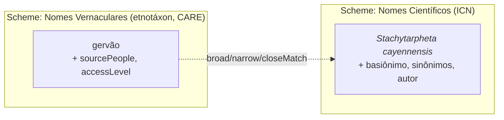

# Avaliação: unificar "Nomes Científicos de Plantas" e "Nomes Vernaculares de Plantas"?

> **Questão.** Considerando o [Manual de Curadoria](Manual.md) e o padrão SKOS-XL, seria
> razoável unificar os campos semânticos **"Nomes Científicos de Plantas"** e **"Nomes
> Vernaculares de Plantas"** num só conceito, visto que ambos seriam representações do mesmo
> conceito de "espécie"? Análise sob a ótica da **etnotaxonomia** e das **regras de nomenclatura
> científica**.

## Veredito

**Não.** Fundir os dois campos num só conceito (nome científico e nome vernacular como rótulos
`pref` do mesmo conceito) seria **incorreto**, apesar de intuitivo. O erro está na premissa:
nome científico e nome vernacular **co-referem** (apontam para plantas sobrepostas no mundo
real), mas **não são o mesmo conceito** no sentido do manual (§2: conceito = unidade de
significado / classificação, não a coisa apontada). Co-referência não é identidade conceitual.

## Por que a premissa "mesmo conceito de espécie" falha

### 1. Etnotaxonomia ≠ taxonomia científica — não há mapa 1:1

O táxon *folk* não corresponde à espécie lineana. Três desencontros clássicos (Berlin,
classificação etnobiológica):

- **Sub-diferenciação:** um nome vernacular cobre várias espécies científicas
  (ex.: "gervão" → várias *Stachytarpheta*).
- **Sobre-diferenciação:** várias etnoespécies (por morfotipo, sexo, estágio de vida ou uso)
  para uma única espécie científica.
- **Homonímia regional:** o mesmo nome vernacular para espécies não aparentadas em regiões/povos
  diferentes; e o mesmo científico com dezenas de vernaculares por comunidade/língua.

O vernacular denota um **etnotáxon** — unidade cultural que pode ser mais ampla, mais estreita ou
transversal à espécie. Não é "outro nome da espécie": é outra unidade de classificação.

### 2. As regras de nomenclatura dão estrutura interna ao nome científico

Sob o **ICN** (*International Code of Nomenclature for algae, fungi, and plants*), uma espécie tem
nome aceito + basiônimo + sinônimos homotípicos/heterotípicos + autor + ano, revisável por revisão
taxonômica. Isso é uma **rede de sinonímia própria** — exatamente o que o manual modela com
"Sinônimo de (aceito)" (§6.3) e depreciação com substituto (§5). Rebaixar o nome científico a um
simples rótulo de um conceito fundido **destrói essa estrutura**.

### 3. Governança e proveniência incompatíveis

| Aspecto | Nome científico | Nome vernacular |
|---|---|---|
| Autoridade | ICN (código nomenclatural) | Comunidade detentora (Princípios CARE) |
| Verificação | Objetiva (WFO / IPNI / Tropicos) | Etnográfica, contextual |
| Idioma | Latim (`lat`) | `por`, línguas indígenas (`tup…`) |
| Proveniência | Autor + ano | `sourcePeople` / `holderPeople` |
| Acesso | Público | Pode ser `restricted` / `sacred` (Nagoya) |

São **dois regimes de autoridade distintos**. Um binômio latino público e um nome ritual indígena
`sacred` como co-rótulos do mesmo conceito conflacionam essas duas governanças.

## O que o próprio manual diz

O guia de decisão (§7) começa em *"os dois termos significam a mesma coisa?"*. Para científico ×
vernacular a resposta honesta é **"não exatamente / nem sempre"** — cai no ramo de **conceitos
distintos**, não no ramo "um conceito, vários rótulos".

O contra-argumento fácil — *"§3.2 permite um `pref` por idioma, logo poderia `pref/lat` +
`pref/por`"* — **não salva a fusão**: os rótulos multilíngues do §3.2 são **tradução do mesmo
conceito** (`gripe` / `influenza` / nome indígena da *mesma* doença). Científico ↔ vernacular
**não é tradução** — é **mapeamento entre dois sistemas de classificação** de granularidade e
governança diferentes.

## O modelo correto

Manter **dois campos / dois *schemes*** e ligá-los por **relação de mapeamento**, não por rótulo:

- **Nome científico** = conceito no seu *scheme* (regido pelo ICN, com sua rede de sinonímia).
- **Nome vernacular** = conceito etnotáxon (com CARE e proveniência por povo).
- **Ligação por *match* SKOS** conforme o ajuste de granularidade:
  - `skos:closeMatch` / `skos:exactMatch` quando há correspondência 1:1;
  - **`skos:broadMatch` / `skos:narrowMatch` quando há sub/sobre-diferenciação** — justamente o
    que captura o desencontro etnotaxonômico.
  - Na paleta atual da tela, o análogo disponível é **"Relacionado (RT)"** entre *schemes*.

Isso alinha com o **Darwin Core** (referência do próprio manual): DwC trata `scientificName` como
identidade do táxon e `vernacularName` como atributo **associado** (extensão *VernacularName*,
muitos-para-um) — **associação, não identidade**.

## Resumo

Co-referência **não** é identidade conceitual. Fundir os campos apagaria a sinonímia
nomenclatural do lado científico, achataria a plasticidade do etnotáxon do lado vernacular e
misturaria as governanças ICN vs CARE. O correto é **dois conceitos ligados por mapeamento**
(`broadMatch` / `narrowMatch` / `closeMatch`), preservando tanto o rigor nomenclatural quanto a
pluralidade e a soberania dos nomes tradicionais.

---

> **Padrões de referência:** [W3C SKOS-XL](https://www.w3.org/TR/skos-reference/skos-xl.html) ·
> [ICN](https://www.iapt-taxon.org/nomen/main.php) ·
> [Darwin Core (TDWG)](https://dwc.tdwg.org/) ·
> [Princípios CARE](https://www.gida-global.org/care) ·
> [Protocolo de Nagoya](https://www.cbd.int/abs/)
