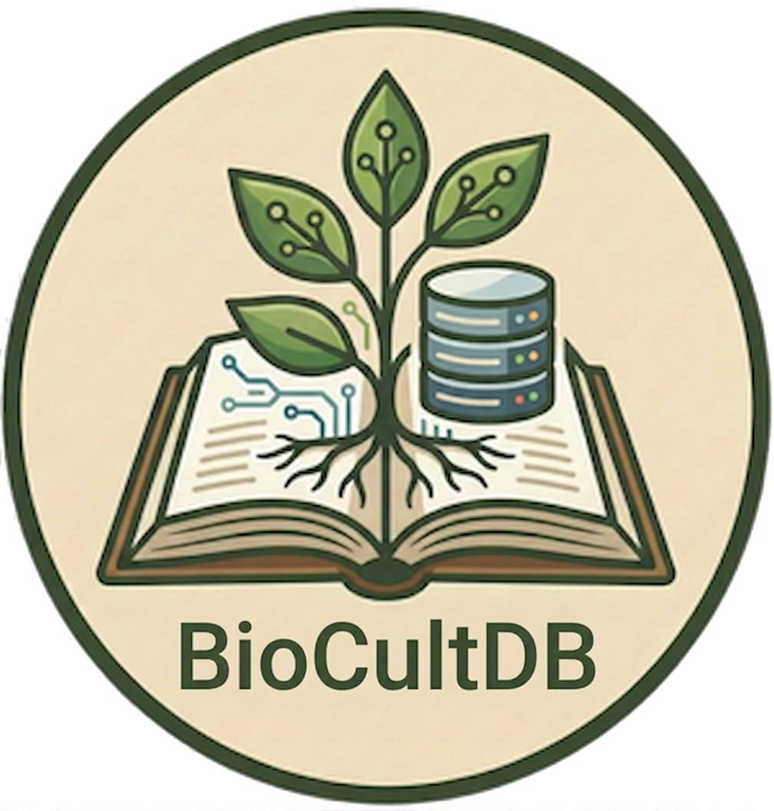
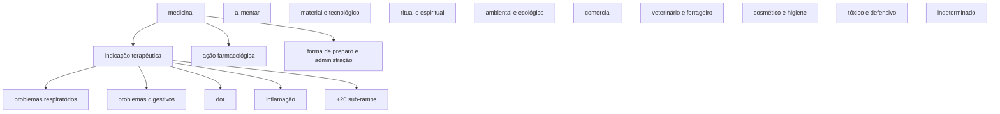
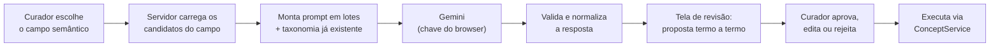

<div align="center">
  
</div>

# Curadoria assistida de Campo Semântico — procedimento, riscos e relatório

### Campo "Tipos de Usos de Plantas" (`comunidades.plantas.tipoUso`, 713 termos)

> **Estado em 2026-08-06: proposta pronta, execução não iniciada.**
> A proposta termo a termo está em [`curadoria-tipos-de-uso-proposta.md`](curadoria-tipos-de-uso-proposta.md);
> o plano executável em [`curadoria/plano-tipouso.json`](curadoria/plano-tipouso.json).
> Este documento registra **o que foi apurado, o que foi decidido e como executar** — inclusive como
> repetir o processo em outro campo semântico e como embuti-lo na interface do BioCultTermos.

---

## Sumário

1. [O que este procedimento faz](#1-o-que-este-procedimento-faz)
2. [Levantamento do estado de produção](#2-levantamento-do-estado-de-produção)
3. [O risco que domina o desenho: ressurreição noturna](#3-o-risco-que-domina-o-desenho-ressurreição-noturna)
4. [Desenho da taxonomia](#4-desenho-da-taxonomia)
5. [Regras de decisão aplicadas](#5-regras-de-decisão-aplicadas)
6. [Procedimento de execução](#6-procedimento-de-execução)
7. [Backup e recuperação](#7-backup-e-recuperação)
8. [Repetindo em outro Campo Semântico](#8-repetindo-em-outro-campo-semântico)
9. [Implementação futura na interface, com Gemini](#9-implementação-futura-na-interface-com-gemini)
10. [Registro do que foi feito nesta sessão](#10-registro-do-que-foi-feito-nesta-sessão)
11. [Pendências e decisões em aberto](#11-pendências-e-decisões-em-aberto)

---

## 1. O que este procedimento faz

Transforma uma lista bruta de termos de um campo semântico — como a aquisição a deposita, cada grafia
virando um conceito candidato isolado — numa rede SKOS-XL curada, conforme o [Manual de Curadoria](Manual.md):
plurais e variantes recolhidos como rótulos, grafias incorretas escondidas mas buscáveis, e uma
hierarquia navegável de conceitos.

O ganho concreto é o que o Manual §1 promete: hoje `asma`, `bronquite`, `tosse` e `gripe` estão soltas e
a pergunta *"quais plantas tratam problemas respiratórios?"* não tem resposta. Depois da curadoria, tem.

**Entrada:** os conceitos `candidate` de um campo semântico.
**Saída:** hierarquia + rótulos + definições, com trilha de auditoria por conceito.

---

## 2. Levantamento do estado de produção

Apurado por acesso direto ao servidor, somente leitura, em 2026-08-06.

### 2.1 Infraestrutura

| Item | Valor |
|---|---|
| Host | `192.168.1.10` (`Asilo`, Unraid 6.18.38) — **não** `192.168.1.1`, que é outra máquina |
| Acesso | `ssh -i <chave> root@192.168.1.10` |
| Container | `BioCultDB`, imagem `ghcr.io/edalcin/biocultdb:latest`, `TZ=America/Sao_Paulo` |
| Banco | `/mnt/user/Storage/appsdata/biocultdb/data/biocultdb.sqlite` (host) → `/data/biocultdb.sqlite` (container) |
| Journal | **WAL ativo** — implica que o backup consistente **não exige parar o container** (ver §7) |
| Portas | 3091→3001, 3092→3002, 3093→3003 (BioCultDB) · 4000 (BioCultTermos público) · 4001 (BioCultTermos admin) |
| Auth admin | Basic Auth, `ADMIN_USERNAME=etnotermos`, senha no env do container |

### 2.2 Modelo de dados

Não há tabela relacional de conceitos: `etnotermos` guarda **um documento JSON por conceito**
(`id`, `doc`, `created_at`, `updated_at`), com `status` e `version` como colunas geradas, e uma
tabela virtual FTS5 (`etnotermos_fts`) para busca.

O **Campo Semântico não é um campo próprio** — é o array `doc.sourceFields`, preenchido pela
aquisição com o caminho do campo de origem no registro do BioCultDB. Distribuição atual:

| `sourceFields` | Conceitos |
|---|---:|
| `comunidades.plantas.nomeVernacular` | 982 |
| `comunidades.plantas.nomeCientifico` | 864 |
| **`comunidades.plantas.tipoUso`** | **713** |
| `comunidades.atividadesEconomicas` | 36 |
| `comunidades.tipo` | 9 |

Um conceito pode pertencer a mais de um campo: `fumo`, `artesanato` e `pesca` têm dois `sourceFields`.

### 2.3 Estado do campo a curar

712 dos 713 conceitos estão `candidate` (só `medicinal` está `active`), e o campo é uma
**folha em branco**: zero definições, zero relações, zero rótulos alternativos, zero ocultos.
Todos os 713 rótulos estão com `language: "pt"` e `accessLevel: "public"`.

Composição do corpus, que é o problema real — o campo chamado "tipos de uso" contém cinco coisas diferentes:

| Natureza | Exemplos | Peso |
|---|---|---|
| Finalidade de uso | `alimentício`, `construção`, `artesanato`, `ritual` | pequeno |
| Enfermidade ou sintoma tratado | `asma`, `dor de cabeça`, `febre` | **maioria** |
| Ação farmacológica atribuída | `diurético`, `expectorante`, `cicatrizante` | médio |
| Parte do corpo, sem enfermidade | `fígado`, `rins`, `peito` | pequeno |
| Objeto produzido | `cesto`, `ponta de flecha`, `velas` | pequeno |
| Ruído | `outros`, `dúvida`, `não especificado`, `enferrujado` | 11 termos |

Somam-se a isso 44 rótulos em inglês gravados como português, 9 grafias incorretas, 17 termos
compostos (`gripe e tosse`) e ~120 variantes de regência ou número da mesma ideia
(`dor de estômago` / `dor no estômago` / `dores estomacais` / `stomache`).

### 2.4 Superfície de escrita disponível

A API Admin (porta 4001) cobre toda a operação e **aplica os invariantes** — este é o motivo de
executar por ela e não escrevendo no SQLite:

| Rota | Efeito |
|---|---|
| `POST /concepts/:id/labels` | adiciona rótulo (`pref`/`alt`/`hidden`, idioma, `accessLevel`, proveniência) |
| `POST /concepts/:id/labels/:labelId/promote` | troca atômica do preferencial |
| `PUT /concepts/:id` | definição, nota de escopo, nota histórica, exemplo |
| `POST /concepts/:id/broader` | hierarquia — com bloqueio de ciclo e cascata de `ancestors` |
| `POST /concepts/:id/related` · `/synonym` | associação e sinonímia, com exclusão mútua entre as duas |
| `POST /concepts/:id/activate` · `/deprecate` | ciclo de vida |

Toda escrita exige `version` (bloqueio otimista, `409` em conflito) e grava em `etnotermos_audit_log`
com o usuário responsável. **Não existe** endpoint de exclusão de conceito nem de operação em massa.

---

## 3. O risco que domina o desenho: ressurreição noturna

Este é o achado que muda o plano, e ele não é óbvio a partir da interface.

`AcquisitionService.run()` roda **todo dia às 03:00** (cron `0 3 * * *`, fuso São Paulo) e semeia
duas fontes: os valores minerados de `biocultdb_records` (259 dos 713 termos) e a lista estática
`REFERENCE_TERMS` (os outros 454). Para cada termo, chama `upsertConcept`, que decide se o termo já
existe com esta consulta:

```sql
SELECT doc FROM etnotermos e
WHERE EXISTS (
  SELECT 1 FROM json_each(json_extract(e.doc,'$.prefLabels')) je
  WHERE json_extract(je.value,'$.literalForm') = ? AND json_extract(je.value,'$.type') = 'pref'
)
```

Ela olha **apenas os `prefLabels`**. Ignora `altLabels` e `hiddenLabels`.

Consequência direta: **toda curadoria que tira um termo da posição de preferencial é desfeita na
madrugada seguinte.**

| Operação de curadoria | Sobrevive ao cron? | Por quê |
|---|:---:|---|
| Recolher `gripes` como `alt` de `gripe` e apagar o conceito de origem | ❌ | `gripes` some dos `prefLabels` → recriado como conceito candidato novo |
| Promover `diarreia` a preferencial, rebaixando `diarréia` a oculto | ❌ | `diarréia` sai dos `prefLabels` → recriado |
| Depreciar `gripes` apontando `gripe` como substituto | ✅ | o conceito depreciado **mantém** seu `prefLabel`; o upsert o encontra e não recria |
| Adicionar `broader`, definição, nota | ✅ | não mexe em `prefLabels` |

Há duas saídas, e elas levam a planos diferentes:

**(a) Conviver com a limitação.** Nunca remover um termo da posição de preferencial. O padrão de fusão
passa a ser: *adiciona o rótulo no conceito-alvo **e** deprecia o conceito de origem apontando o alvo* —
o termo continua existindo como preferencial de uma lápide, o cron o reconhece, e nada é recriado.
Não exige tocar em código. **É o que a proposta atual assume.** Custo: o vocabulário fica com ~416
conceitos depreciados convivendo com 328 vivos.

**(b) Corrigir a raiz.** Fazer `upsertConcept` casar também em `altLabels` e `hiddenLabels`. É um diff
pequeno, mas mora no submódulo `bioculttermos` (repositório separado `edalcin/BioCultTermos`), e exige
commit lá, atualização do ponteiro do submódulo, rebuild da imagem e redeploy. Com isso, fusões
limpas passam a ser possíveis e o vocabulário fica sem as lápides.

> **Recomendação:** (b), e antes de qualquer curadoria. A correção é de três linhas e elimina uma classe
> inteira de regressão silenciosa — o pior tipo, porque a interface não mostra que aconteceu.
> Enquanto (b) não estiver em produção, executar **só** o padrão (a).

Um terceiro cuidado, independente da escolha: **não executar a curadoria durante a janela do cron.**
Uma execução concorrente vai colidir com o bloqueio otimista e devolver `409` no meio do lote.

---

## 4. Desenho da taxonomia

Uma árvore só, com dez facetas de 1º nível, profundidade máxima 4, poli-hierarquia permitida onde
o significado exige. Verificada sem ciclos.



Três decisões estruturais merecem registro:

**Doenças ficam sob `medicinal`, não em campo separado.** É o que o Manual §6.1 e §9 já desenham. A
alternativa — separar "finalidade de uso" de "indicação terapêutica" em dois campos semânticos —
exigiria mudar `MONITORED_FIELDS` e a origem do dado no BioCultDB, e não se justifica.

**Distinguir indicação de ação farmacológica.** `febre` (o que a pessoa tem) e `antitérmico` (o que a
planta faz) são conceitos diferentes e ficam em ramos irmãos sob `medicinal`. Confundi-los é o erro
que mais aparece no corpus bruto.

**Criar a faceta `indeterminado`.** Não é elegância, é necessidade: `POST /concepts/:id/deprecate`
**exige** `replacedById`, e não existe substituto legítimo para `outros`, `dúvida` ou
`não especificado`. Sem um destino terminal explícito, esses 11 termos ficariam `candidate` para
sempre — que é justamente o erro que o Manual §10 lista.

---

## 5. Regras de decisão aplicadas

Aplicação direta do fluxo do Manual §7, na ordem em que cada teste é feito:

| Situação no corpus | Teste | Decisão | Exemplo |
|---|---|---|---|
| Plural do mesmo termo | mesma ideia, mesmo conceito | rótulo **alternativo** | `gripes` → `gripe` |
| Variante de regência | mesma ideia | rótulo **alternativo** | `dor de estômago`, `dores estomacais` → `dor no estômago` |
| Grafia incorreta ou pré-Acordo | mesma ideia, forma errada | rótulo **oculto** | `diarréia`, `gazes`, `hemorróidas` |
| Termo em inglês | mesma ideia, outro idioma | rótulo **alternativo**, `language: eng` | `headache` → `dor de cabeça` |
| Caso específico de outro | é um tipo de | **hierarquia** (`broader`) | `dor de cabeça` → `dor` |
| Distintos mas associados | nem tipo, nem sinônimo | **relacionado (RT)** | `gripe` ↔ `resfriado` |
| Termo composto | co-ocorrência de dois conceitos | **depreciar** apontando o principal | `gripe e tosse` → `gripe` |
| Sem conteúdo informativo | não nomeia uso algum | **depreciar** → `indeterminado` | `outros`, `dúvida` |
| Pertence a outro campo | nome vernacular no campo errado | **não tocar** | `fumo` |

Nenhum caso do corpus justificou a relação **"Sinônimo de (aceito)"** — ela existe para reconciliar
conceitos que já foram curados separadamente, com definição e proveniência próprias (Manual §6.3), e
aqui todos os 713 chegaram crus, sem história a preservar. Vale a preferência do Manual §7:
um conceito com vários rótulos, não vários conceitos ligados por sinonímia.

Sobre **CARE**: os 713 rótulos são `public` e nenhum vem de língua indígena — são termos de uso
recolhidos da literatura, em português e inglês. Nenhuma reclassificação de `accessLevel` se aplica
neste campo. Isso **mudará** no campo `nomeVernacular`, onde os nomes têm povo de origem e podem
exigir `restricted` ou `sacred` (Manual §3.3).

---

## 6. Procedimento de execução

Cinco fases. Cada uma é verificável antes da seguinte.

### Fase 0 — Preparar

1. Backup consistente (§7).
2. Confirmar que a correção de `upsertConcept` está em produção, **ou** assumir explicitamente o
   padrão (a) do §3.
3. Confirmar que não se está na janela do cron (03:00, fuso São Paulo).
4. Ler `ADMIN_PASSWORD` do env do container; autenticar em `http://192.168.1.10:4001/`.

### Fase 1 — Criar a estrutura

Criar os 31 conceitos-pai novos e definir os 6 que já existem como pai
(`alimentar`, `dor`, `febre`, `inflamação`, `problemas digestivos`, `problemas respiratórios`).
Cada um recebe definição e, quando há risco de confusão com um vizinho, nota de escopo.

Ligar as facetas de 2º e 3º nível aos seus pais. Ao final desta fase a árvore existe, vazia.

### Fase 2 — Absorver rótulos

Para cada operação `ALT` e `HID` do plano, na ordem:

1. `POST /concepts/{alvo}/labels` com `literalForm`, `type` (`alt`/`hidden`), `language`
   (`por` ou `eng`), `accessLevel: public`.
2. `POST /concepts/{origem}/deprecate` com `replacedById: {alvo}`.

Se a resposta for `409`, reler o conceito, pegar a `version` nova e repetir — sinal de que outra
escrita ocorreu no intervalo.

### Fase 3 — Montar a hierarquia

Para cada operação `BT`, `POST /concepts/{id}/broader` com o pai. A recíproca `narrower` e a cascata
de `ancestors` são automáticas. O bloqueio de ciclo é do sistema; a proposta já foi verificada sem ciclos.

### Fase 4 — Definições e ativação

`PUT /concepts/:id` com definição para todo conceito sobrevivente. Nota de escopo obrigatória onde
a fronteira é sutil — `calmante` × `sedativo` × `tranquilizante`, `dor` × `inflamação`,
`indicação terapêutica` × `ação farmacológica`.

Depois, `POST /concepts/:id/activate` nos que ficaram completos. Os duvidosos permanecem `candidate`.

### Fase 5 — Conferir

| Verificação | Como |
|---|---|
| Contagem bate com o plano | `SELECT status, count(*)` filtrando o `sourceFields` |
| Nenhum órfão | todo conceito ativo tem `broader` ou é faceta raiz |
| Sem ciclo | `ancestors` de todo conceito não contém ele mesmo |
| Trilha completa | `etnotermos_audit_log` tem entrada para cada operação |
| **Sobrevive ao cron** | `POST /acquisition/run` manualmente e reconferir as contagens — este é o teste que importa |
| Consulta pública responde | buscar `problemas respiratórios` na porta 4000 e ver `asma`, `tosse`, `gripe` |

O último teste da Fase 5 é o único que prova que a curadoria é permanente. Executá-lo.

---

## 7. Backup e recuperação

Com WAL ativo, `VACUUM INTO` produz um snapshot íntegro **com o container no ar**:

```bash
D=/mnt/user/Storage/appsdata/biocultdb/data
B=$D/backup-pre-curadoria-tipouso-$(date +%Y-%m-%dT%H-%M-%SZ).sqlite
sqlite3 "file:$D/biocultdb.sqlite?mode=ro" "VACUUM INTO '$B';"
sqlite3 "$B" 'PRAGMA integrity_check;'   # deve responder: ok
```

Parar o container **não** é recomendado: a API Admin é o único caminho de escrita que aplica os
invariantes (ciclo, reciprocidade, `ancestors`, `version`, auditoria), e ela exige o serviço no ar.
Escrever direto no JSON com o container parado troca um risco pequeno e já mitigado — corromper o
arquivo — por um risco grande e silencioso: corromper o **vocabulário**.

Restauração:

```bash
docker stop BioCultDB
cp $B $D/biocultdb.sqlite
rm -f $D/biocultdb.sqlite-wal $D/biocultdb.sqlite-shm
docker start BioCultDB
```

---

## 8. Repetindo em outro Campo Semântico

O procedimento é genérico; muda o filtro e o desenho da taxonomia. Para
`comunidades.plantas.nomeVernacular` (982 termos) ou `nomeCientifico` (864):

```sql
SELECT json_extract(doc,'$.id'), json_extract(doc,'$.prefLabels[0].literalForm')
FROM etnotermos
WHERE EXISTS (SELECT 1 FROM json_each(json_extract(doc,'$.sourceFields')) x
              WHERE x.value = '<campo>');
```

Três diferenças importam:

**`nomeVernacular` é o campo sensível.** Aqui os princípios CARE deixam de ser teóricos: cada rótulo
tem povo de origem, pode exigir `restricted` ou `sacred`, e a escolha do preferencial entre nomes
co-iguais precisa da nota de escopo prescrita no Manual §3.5. E vale a regra de ouro do §7.2 — dois
nomes vernaculares da mesma planta são rótulos alternativos de **um** conceito, exceto quando a
comunidade os distingue como etnotáxons diferentes.

**`nomeCientifico` não se funde com `nomeVernacular`.** Manual §7.3: são dois conceitos que
co-referem, ligados por mapeamento, nunca fundidos — governanças diferentes (ICN × comunidade).

**A ressurreição noturna vale para todos os campos.** `upsertConcept` é o mesmo código. O §3 se aplica
integralmente.

---

## 9. Implementação futura na interface, com Gemini

O que segue é o desenho para embutir esta curadoria no BioCultTermos como funcionalidade, e não como
operação manual.

### 9.1 A chave de API

**Não existe chave Gemini registrada no servidor** — verificado: `app_config` tem uma única linha
(`extraction_prompt`) e não há chave no env do container. Isto é intencional:
[ADR-002](decisions/ADR-002-extracao-por-ia.md) decidiu (D5) que a chave vive no `localStorage` do
browser, transita no corpo do POST e nunca é persistida.

A funcionalidade deve **seguir o mesmo padrão**, reusando o que já existe:
`backend/src/services/ai-providers.js` (`createClient`, `completeText`, `PROVIDERS` com
`gemini-2.5-flash`/`2.5-pro`) e a redação de chaves em log de `shared/logger.js`. Nenhuma decisão nova
de segurança é necessária — só não regredir a que já foi tomada.

### 9.2 Fluxo proposto



O ponto que não pode ser negociado é **F**: a IA propõe, o curador decide. Escrever direto no
vocabulário sem revisão contradiz o papel do curador que o Manual inteiro pressupõe.

### 9.3 O que construir

| Peça | Onde | O que faz |
|---|---|---|
| `CurationProposalService` | `bioculttermos/backend/src/services/` | monta lotes, chama o provedor, valida a resposta contra o schema, devolve a proposta |
| Prompt versionado | `app_config`, chave `curation_prompt` | mesmo padrão do `extraction_prompt` (ADR-002 D6): editável sem redeploy |
| `POST /curation/propose` | admin 4001 | recebe `{semanticField, provider, apiKey, model}`, devolve a proposta; **não escreve nada** |
| `POST /curation/apply` | admin 4001 | recebe a proposta revisada, executa via `ConceptService`, grava auditoria |
| Tela de revisão | admin | tabela editável: termo, operação, destino, justificativa; aprovar em bloco ou linha a linha |
| Persistência da proposta | nova tabela ou `app_config` | permite revisar em várias sessões sem reprocessar |

### 9.4 Contrato de saída da IA

Um objeto por termo, validado antes de chegar à tela — descartar item malformado é preferível a
propor lixo ao curador:

```json
{
  "term": "gripes",
  "op": "ALT",
  "target": "gripe",
  "language": "por",
  "rationale": "plural de 'gripe'; mesma unidade de significado (Manual §3.1)",
  "confidence": 0.98
}
```

`op` ∈ `BT` | `ALT` | `HID` | `RT` | `DEP` | `SKIP`. O `rationale` não é enfeite: é o que permite ao
curador julgar rápido, e é o que deve ir para a nota histórica quando a decisão não for óbvia.

### 9.5 Limites conhecidos

Lotes precisam ser pequenos o bastante para caber no contexto **junto com a taxonomia já construída** —
sem ela o modelo propõe pais que não existem. Termos de baixa `confidence` devem subir no topo da
tela de revisão, não afundar no fim da lista. E a proposta precisa ser recalculável: se o curador
rejeitar um agrupamento, os termos dependentes dele voltam à fila.

---

## 10. Registro do que foi feito nesta sessão

Somente leitura em produção, exceto pela criação do arquivo de backup.

| # | Ação | Resultado |
|---|---|---|
| 1 | Corrigido o endereço do servidor | `192.168.1.1` recusou a chave e é outra máquina (Debian); o Unraid é `192.168.1.10` |
| 2 | Inventariado o modelo de dados | `etnotermos` documento-JSON; campo semântico = `sourceFields` |
| 3 | Confirmado o recorte | 713 conceitos em `comunidades.plantas.tipoUso`, 712 `candidate`, sem definições nem relações |
| 4 | **Refutada a premissa da chave Gemini** | não há chave no servidor; ADR-002 D5 decidiu que nunca haverá |
| 5 | **Identificado o risco de ressurreição noturna** | `upsertConcept` casa só em `prefLabels`; documentado no §3 |
| 6 | Backup de produção | `backup-pre-curadoria-tipouso-2026-08-06T17-45-03Z.sqlite`, `integrity_check: ok`, md5 `722f4aee…`, sem downtime |
| 7 | Desenhada a taxonomia | 10 facetas, 37 conceitos-pai, profundidade 4, sem ciclos |
| 8 | Classificados os 713 termos | 297 mantidos · 362 → rótulo alt · 9 → rótulo oculto · 44 depreciados · 1 intocado |
| 9 | Validada a consistência | 0 termos sem decisão, 0 alvos inexistentes, 0 cadeias de fusão, 0 auto-referências, 0 ciclos |
| 10 | Gerados os artefatos | `curadoria-tipos-de-uso-proposta.md`, `curadoria/plano-tipouso.json`, este documento |

**Nenhuma escrita foi feita na tabela `etnotermos`.** O vocabulário de produção está como estava.

Resultado projetado: **713 → 328 conceitos**, redução de 54%.

---

## 11. Pendências e decisões em aberto

Nada abaixo pode ser decidido sem o curador.

1. **Corrigir `upsertConcept` antes de executar?** (§3) — recomendado: sim. Sem isso, o padrão de
   fusão fica preso ao modo (a) e o vocabulário acumula ~416 conceitos depreciados.
2. **`pt` ou `por`?** Os 713 rótulos usam `pt` (ISO 639-1, cravado em `AcquisitionService.js:123`),
   mas o Manual §3.2 e o comentário de `createLabel` dizem ISO 639-3. Recomendado: `por`/`eng`, que é
   o único que codifica as línguas indígenas (`tup`, `kgp`) — com migração dos 713 rótulos existentes.
3. **Ativar em massa?** O campo inteiro está invisível na consulta pública hoje. Recomendado: ativar
   os conceitos completos, deixar `candidate` os duvidosos.
4. **Termos compostos** (17): depreciar para um substituto descarta a outra metade
   (`gripe e tosse` → `gripe` perde a tosse). Alternativa: rótulo oculto nos dois conceitos.
5. **Revisão em bloco ou por lote temático?** Recomendado: revisar a proposta inteira uma vez e
   discutir só as divergências.

---

> **Referências:** [Manual de Curadoria](Manual.md) ·
> [ADR-001 — integração BioCultTermos](decisions/ADR-001-integracao-bioculttermos.md) ·
> [ADR-002 — extração por IA](decisions/ADR-002-extracao-por-ia.md) ·
> [W3C SKOS-XL](https://www.w3.org/TR/skos-reference/skos-xl.html) ·
> [Princípios CARE](https://www.gida-global.org/care)
